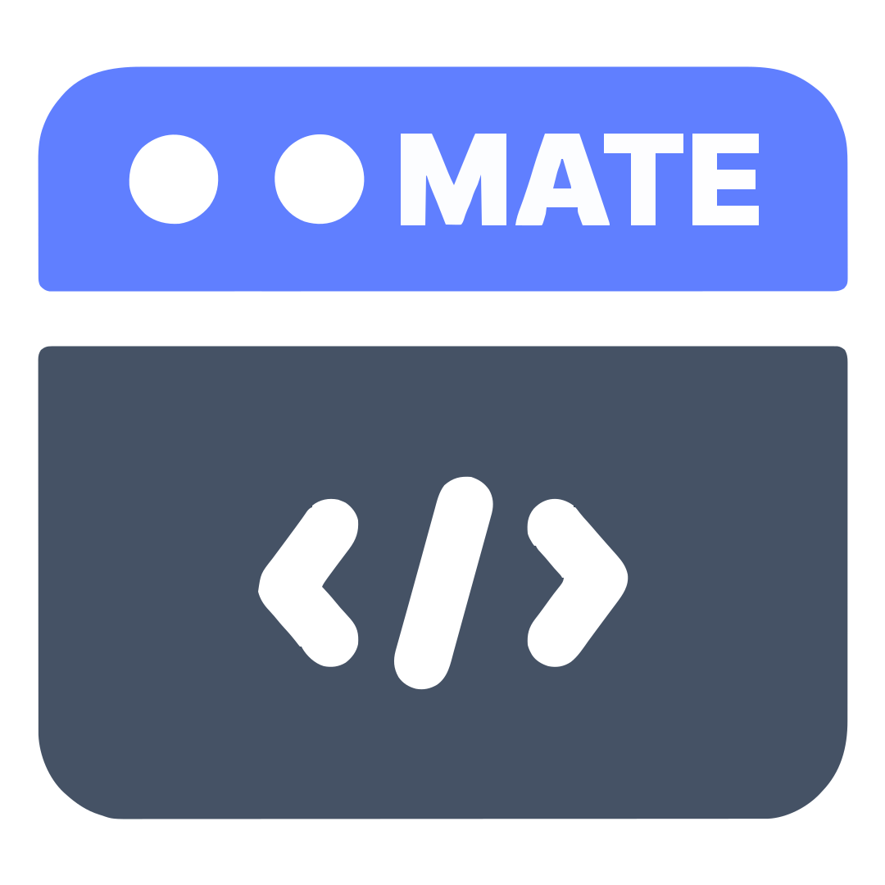
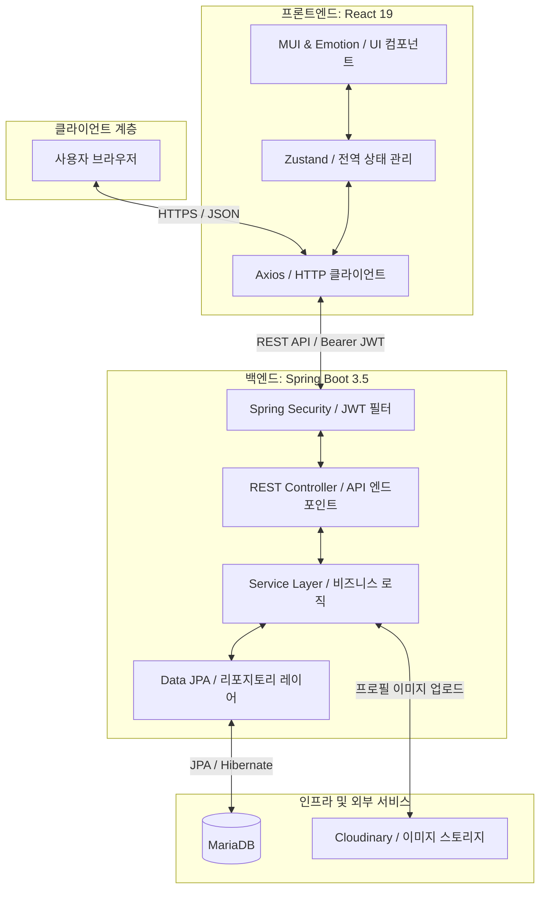

# 🤝 MATE: 스터디 & 프로젝트 매칭 플랫폼

<div align="center">
  
  
  <p align="center">
    <strong>"원하는 스터디와 프로젝트, 최적의 팀원을 찾는 가장 스마트한 방법"</strong>
  </p>

  <p align="center">
    
    
    
    
    
    
  </p>
</div>

---

## 🚀 프로젝트 개요 (Overview)

**MATE**는 개발자, 디자이너, 기획자가 모여 사이드 프로젝트 팀원을 모집하고 스터디 그룹을 개설하여 협업할 수 있도록 돕는 매칭 웹 애플리케이션입니다.
복잡하고 번거로운 구인 과정을 최소화하고, 기술 스택과 포지션을 기반으로 나와 가장 잘 맞는 'MATE'를 찾을 수 있도록 돕습니다.

- **프로젝트 모집 & 매칭**: 프로젝트 개설자는 상세 역할군과 기술 스택을 지정하여 공고를 작성하고, 지원자의 프로필을 검토하여 합류 여부를 결정합니다.
- **스터디 그룹 형성**: 관심 분야가 같은 사람들끼리 스터디 모집글을 올려 지식을 공유하고 학습할 수 있습니다.
- **실시간 관리**: 마이페이지를 통해 지원 현황과 모집자 입장에서의 매칭 관리를 실시간으로 처리합니다.

---

## ✨ 핵심 기능 (Key Features)

### 👥 회원 및 인증 (Auth & User Profile)

- **JWT 기반 인증**: Access Token 및 Refresh Token 구조를 활용한 안전하고 지속적인 로그인 세션 관리.
- **포지션/기술 스택 관리**: 본인의 직군(프론트엔드, 백엔드, 디자이너, 기획 등)과 다룰 수 있는 기술 스택을 프로필에 설정.

### 📋 프로젝트 및 스터디 모집 (Recruitment Board)

- **다양한 필터링**: 카테고리(프로젝트/스터디), 기술 스택, 키워드 별 스마트 필터링 및 검색.
- **상세 조건 설정**: 모집 정원, 진행 기간, 온/오프라인 여부, 요구 기술 스택 정의.
- **댓글 소통**: 상세 모집 페이지 내에서 자유로운 사전 질의응답 및 피드백.

### ✉️ 지원 & 매칭 시스템 (Application & Matching)

- **원클릭 지원**: 지원 동기를 작성하여 관심 있는 프로젝트에 바로 지원.
- **지원자 수락/거절**: 작성자(방장)는 마이페이지를 통해 신청 대기자 명단을 확인하고 수락 혹은 거절 가능.
- **프로젝트 멤버 목록**: 매칭이 성사된 팀원들의 포지션과 프로필을 목록으로 확인.

### 💬 협업 공간 (Project Internal Board)

- **팀 전용 게시판**: 최종 매칭된 멤버들만 접근하여 글을 쓰고 댓글을 달 수 있는 소통 창구 제공.

### 🛠️ 관리자 기능 (Admin Console)

- **대시보드**: 전체 가입자 수, 진행 중인 프로젝트 수 등 핵심 지표 시각화.
- **데이터 복구**: 실수로 삭제되거나 보관 처리된 회원 정보 및 리소스를 복구하는 백 오피스 툴.

---

## 🛠 기술 스택 (Tech Stack)

### Front-End

- **Framework & Runtime**: React 19 (Vite 기반)
- **Routing**: React Router Dom v7
- **State Management**: Zustand (Auth, Post, UI Global State)
- **UI & Styling**: Material-UI (MUI v6), @emotion/react, @emotion/styled
- **Network**: Axios (Interceptor를 활용한 토큰 재발급 자동화)
- **Development Tooling**: Mock Service Worker (MSW)를 사용한 독립적 API 모킹 환경

### Back-End

- **Language & JDK**: Java 17
- **Framework**: Spring Boot 3.5.x
- **Build Tool**: Maven
- **Database & JPA**: MariaDB, Spring Data JPA (Hibernate)
- **Security**: Spring Security, JWT (JSON Web Token), BCrypt Encryption
- **File Storage**: Cloudinary (사용자 프로필 이미지 원격 업로드 및 저장)
- **Monitoring & Metrics**: Spring Boot Actuator, Spring Boot Admin
- **Utility**: Lombok, Custom Mapper (DTO-Entity 간 매퍼 클래스 구현)

---

## 📂 프로젝트 구조 (Repository Directory Structure)

MATE는 프론트엔드(React)와 백엔드(Spring Boot) 레포지토리가 통합되어 관리되는 모노레포 구조를 가집니다.

```text
SK-Rookies5-MINI2_MATE/
├── MATE-frontend/             # React Client Web App
│   ├── src/
│   │   ├── api/               # Axios Instance & Interceptors
│   │   ├── component/         # Reusable UI Components (common, layout)
│   │   ├── constants/         # Static Data Definitions
│   │   ├── mocks/             # MSW Mock Handlers for Local Dev
│   │   ├── pages/             # Route Pages (Main, PostDetail, Auth, MyPage)
│   │   ├── store/             # Zustand Stores (authStore, etc.)
│   │   └── styles/            # MUI Custom Theme Definitions
│   └── package.json
│
├── MATE-backend/              # Spring Boot REST API Server
│   ├── src/main/java/.../
│   │   ├── common/            # Success/Error Base Responses
│   │   ├── config/            # Security, Web, Cloudinary Configs
│   │   ├── controller/        # REST APIs (Auth, Project, Apply, Admin)
│   │   ├── entity/            # JPA Entities & Enums
│   │   ├── repository/        # Spring Data JPA Repository Interfaces
│   │   ├── security/          # JWT Helpers & Filters
│   │   └── service/           # Business Logic Interfaces & Impls
│   └── pom.xml

```

---

## 📊 시스템 아키텍처 (System Architecture)

MATE 서비스의 서비스 구조 및 모듈 간 관계는 다음과 같습니다.



---

## 🌟 프로젝트 핵심 차별화 포인트 (Portfolio Highlights)

포트폴리오 관점에서 본 프로젝트에 적용된 핵심 기술적 의사결정과 문제 해결 능력입니다.

### 1. MSW(Mock Service Worker) 도입을 통한 개발 병목 해결
- **도입 배경**: 프론트엔드와 백엔드 개발 시 발생하는 API 연동 의존성으로 인한 개발 지연 문제를 방지하고자 했습니다.
- **해결 방안**: 서비스 기획 단계에서 설계된 API 명세를 기반으로 프론트엔드에 **MSW**를 적용해 로컬 환경에서 API 모킹을 수행했습니다.
- **성과**: 백엔드 서버가 완성되지 않은 시점에서도 로그인, CRUD 등 프론트엔드의 핵심 기능 구현과 테스트를 병렬적으로 완수할 수 있었습니다.

### 2. Axios Interceptor를 통한 사일런트 JWT 갱신 구현
- **도입 배경**: Access Token 만료 시마다 사용자가 강제 로그아웃되거나 수동으로 세션을 유지해야 하는 불합리한 UX를 해소하고자 했습니다.
- **해결 방안**: Axios **Response Interceptor**를 설계하여 API 호출 시 `401 Unauthorized` 에러가 감지되면, 브라우저 백그라운드에서 자동으로 Refresh Token 검증 및 Access Token 갱신 요청을 시도하도록 구현했습니다.
- **성과**: 갱신 완료 후 실패했던 원래의 API 요청을 재수행하게 함으로써, 사용자가 인지하지 못하는 사이에 안전하고 매끄러운 세션 연장이 이루어집니다.

### 3. Custom Mapper 클래스 정의를 통한 DTO 격리 및 유지보수성 향상
- **도입 배경**: Entity와 DTO 간의 데이터 변환 코드가 서비스(Service) 계층에 혼재되어 비즈니스 로직의 가독성을 저해하고 중복 코드가 발생하는 구조를 탈피하고자 했습니다.
- **해결 방안**: 데이터 전송 및 변환 역할을 전담하는 별도의 **Mapper 클래스**들을 구현하고, Lombok의 `@Builder` 패턴을 활용하여 명시적이고 안전한 매핑 코드를 작성했습니다.
- **성과**: 영속성 레이어(Entity)와 프레임워크 스펙에 독립적인 프리젠테이션 레이어(DTO)의 관심사를 완벽히 분리하였으며, 유지보수 시 서비스 코드 수정 없이 매퍼 클래스 변경만으로 API 응답 포맷 수정이 가능하도록 아키텍처를 개선했습니다.

### 4. Cloudinary를 활용한 이미지 스토리지 성능 최적화
- **도입 배경**: 다수의 유저 프로필 이미지를 어플리케이션 서버 자체의 파일 시스템에 저장할 시 발생할 수 있는 스토리지 부하와 이식성 저하 문제를 고려했습니다.
- **해결 방안**: 클라우드 기반 미디어 관리 서비스인 **Cloudinary** 라이브러리를 연동하여, 업로드된 이미지 파일이 저장 및 CDN 배포되도록 구조를 설계했습니다.
- **성과**: 서버 디스크 사용량을 절감함과 동시에 전 세계 어디서나 빠른 이미지 리소스 로딩 성능을 확보했습니다.

### 5. Zustand 기반의 데이터 정규화 및 API 규격 매핑 브릿지 설계
- **도입 배경**: 백엔드 API 명세서 버전 업데이트 과정에서 일부 변수명 규격(예: `id` vs `userId`, `profileImg` vs `profileImageUrl`) 불일치가 발생하였고, 페이징 데이터 포맷이 API 엔드포인트별로 다르게 가공되어 컴포넌트 레벨에서의 재사용성과 일관성을 저해하는 문제가 있었습니다.
- **해결 방안**: Zustand 전역 상태 관리 스토어(`authStore`, `postStore`)에 **데이터 클렌징 및 매핑 브릿지 레이어**를 내장하여, API 응답 데이터를 프론트엔드 내부 표준 규격으로 일괄 변환 및 정규화(Normalization)하여 저장하도록 설계했습니다.
- **성과**: UI 화면 컴포넌트 영역에서는 백엔드 API 변경 스펙에 영향을 받지 않고 오직 동일한 데이터 포맷만을 안정적으로 소비할 수 있게 됨으로써 화면 결합도를 크게 낮추고 휴먼 에러를 미연에 방지했습니다.

### 6. MUI Custom Theme 설정을 통한 디자인 시스템(Design System) 구축
- **도입 배경**: 하드코딩된 인라인 스타일링(Inline Styling)은 프로젝트 규모가 커질수록 UI 일관성을 해치고 디자인 수정 공수를 크게 증가시키는 디자인 부채(Design Debt) 문제를 유발합니다.
- **해결 방안**: Material-UI의 `createTheme` 인터페이스를 확장해 서비스 아이덴티티에 최적화된 브랜드 컬러 팔레트(Primary `#6C63FF`, Primary Soft `#EDE9FF` 등), Pretendard 웹폰트 스택, 그리고 전역 둥글기 값(`borderRadius: 16`) 등을 **디자인 토큰(Design Token)**으로 규격화했습니다.
- **성과**: 전역 스타일 오버라이드(`styleOverrides` for Button, Card, Chip)를 적용하여 공통 컴포넌트 호출만으로 입체적인 소프트 섀도우와 일관된 브랜딩 테마를 유지할 수 있었으며, 스타일 파편화를 원천 차단하고 UI 작업 생산성을 크게 배가시켰습니다.

---

## ⚙️ 설치 및 실행 방법 (Getting Started)

### Prerequisites

- JDK 17 이상
- Node.js 18.x 이상 및 npm
- MariaDB 10.x 이상

### 1. Database 설정

로컬 MariaDB에 접속하여 프로젝트용 스키마를 생성합니다.

```sql
CREATE DATABASE mate_db;
```

### 2. Backend 실행

1. `MATE-backend` 디렉토리로 이동합니다.
   ```bash
   cd MATE-backend
   ```
2. `src/main/resources/application-dev.properties` 파일을 생성하거나 알맞게 수정합니다.
   ```properties
   spring.datasource.url=jdbc:mariadb://localhost:3306/mate_db
   spring.datasource.username=사용자이름
   spring.datasource.password=비밀번호
   jwt.secret=최소_32글자_이상의_임의의_시크릿_키
   # Cloudinary 계정이 있다면 추가 설정
   cloudinary.cloud-name=your_cloud_name
   cloudinary.api-key=your_api_key
   cloudinary.api-secret=your_api_secret
   ```
3. 서버를 구동합니다.

   ```bash
   # Windows
   mvnw.cmd spring-boot:run

   # Linux/macOS
   ./mvnw spring-boot:run
   ```

   - 백엔드 서버는 `http://localhost:8080`에서 구동됩니다.

### 3. Frontend 실행

1. `MATE-frontend` 디렉토리로 이동합니다.
   ```bash
   cd MATE-frontend
   ```
2. `.env.development` 환경 변수를 설정합니다.
   ```env
   VITE_API_BASE_URL=http://localhost:8080/api
   ```
3. 패키지를 설치하고 개발 서버를 시작합니다.
   ```bash
   npm install
   npm run dev
   ```

   - 프론트엔드 웹 앱은 `http://localhost:5173`에서 확인할 수 있습니다.

---

## 🖥️ 주요 화면 가이드 (Features Walkthrough)

### 1. 메인 페이지 (Main Discovery)
- **설명**: 최신 프로젝트 및 스터디 모집글을 한눈에 탐색할 수 있는 허브 화면입니다. 카테고리(프로젝트/스터디), 기술 스택 필터, 키워드 검색을 조합하여 원하는 모집공고를 신속하게 필터링할 수 있습니다.
- *(추후 화면 캡처 및 GIF 추가 영역)*

### 2. 모집공고 상세 및 지원 (Project Detail & Apply)
- **설명**: 프로젝트의 진행 기간, 온/오프라인 여부, 모집 직군(프론트엔드/백엔드/기획 등), 요구 스택 등 상세 구인 조건을 보여줍니다. 
- **지원 프로세스**: 하단의 '지원하기' 버튼을 눌러 지원 동기를 입력하면 즉시 지원서가 제출됩니다.
- *(추후 화면 캡처 및 GIF 추가 영역)*

### 3. 마이페이지 - 모집 관리 (Recruitment Dashboard)
- **설명**: 자신이 생성한 모집글에 지원한 유저들의 프로필과 포지션, 지원 동기를 확인하는 방장 전용 대시보드입니다.
- **매칭 매커니즘**: 각 지원자 카드 우측의 '수락' 혹은 '거절' 버튼을 눌러 직관적으로 팀원을 빌딩할 수 있습니다.
- *(추후 화면 캡처 및 GIF 추가 영역)*

### 4. 마이페이지 - 지원 현황 (My Applications)
- **설명**: 내가 참여를 신청한 프로젝트/스터디 목록과 각 매칭 상태(승인 대기, 수락됨, 거절됨)를 실시간으로 확인하는 개인 대시보드입니다.
- *(추후 화면 캡처 및 GIF 추가 영역)*

### 5. 팀 전용 협업 게시판 (Private Board)
- **설명**: 모집이 완료되어 합격된 팀원들만 접근할 수 있는 내부 소통용 Private 공간입니다. 외부 유저의 접근을 막아 팀 전용 공지나 협업 링크 공유 등의 원활한 소통을 보조합니다.
- *(추후 화면 캡처 및 GIF 추가 영역)*

---

## 🔧 Backend details (`MATE-backend`)

### 프로젝트 구조

```text
src/main/java/com/rookies5/Backend_MATE/
├── common/              # 공통 응답 처리 (SuccessResponse)
├── config/              # Security, Web, Cloudinary 등 설정 클래스
├── controller/          # REST API 컨트롤러
├── dto/                 # Request/Response Data Transfer Object
├── entity/              # JPA 엔티티 및 Enum (BaseEntity 상속)
├── exception/           # 전역 예외 처리 및 커스텀 에러 코드
├── mapper/              # Entity <-> DTO 변환 로직 (Mapper)
├── repository/          # Spring Data JPA 리포지토리
├── security/            # JWT 및 시큐리티 관련 유틸리티 (JwtTokenProvider 등)
└── service/             # 비즈니스 로직 인터페이스 및 구현체 (impl)
```

### 핵심 도메인 및 ERD 개요

- **User (회원)**: 닉네임, 기술 스택, 포지션 정보를 보유하며 여러 프로젝트를 소유하거나 참여할 수 있습니다.
- **Project (모집글)**: 카테고리, 모집 인원, 기술 스택을 정의하며 특정 `User`가 생성(Owner)합니다.
- **Application (지원서)**: `User`가 `Project`에 지원할 때 생성되며, 방장에 의해 승인/거절 상태가 결정됩니다. (1:N 관계)
- **ProjectMember (참여 멤버)**: 프로젝트에 최종 합류된 인원들을 관리합니다. (User-Project N:M 해소 엔티티)
- **BoardPost & Comment**: 각 프로젝트 내에서 소통을 위한 게시글과 댓글 기능을 제공합니다.

### 주요 API 기능 요약

#### 인증 및 회원 (Auth & User)
- `POST /api/auth/signup`: 회원가입
- `POST /api/auth/login`: 로그인 및 JWT 발급
- `GET /api/users/me`: 내 정보 조회 및 수정 (`PATCH /me`)
- `GET /api/users/me/posts/owned`: 내가 생성한 프로젝트 목록 조회

#### 프로젝트 모집 (Project)
- `POST /api/projects`: 모집글 생성
- `GET /api/projects`: 전체 목록 조회 (필터링: 카테고리, 키워드)
- `PATCH /api/projects/{id}/close`: 모집 수동 마감
- `PATCH /api/projects/{id}/reopen`: 프로젝트 재모집 시작

#### 지원 및 멤버 (Application & Member)
- `POST /api/applications/{projectId}`: 프로젝트 지원하기
- `PATCH /api/applications/{id}/status`: 지원서 상태 변경 (승인/거절)
- `GET /api/posts/{projectId}/members`: 프로젝트 참여 멤버 조회

#### 게시판 및 댓글 (Board & Comment)
- `GET /api/posts/{projectId}/board`: 프로젝트 내 게시글 목록
- `POST /api/posts/{projectId}/board/{postId}/comments`: 댓글 작성

#### 관리자 (Admin)
- `GET /admin/dashboard`: 전체 서비스 현황 대시보드
- `POST /admin/users/restore/{id}`: 삭제된 회원 및 데이터 복구

---

## 🎨 Frontend details (`MATE-frontend`)

### 디렉토리 구조

```bash
src/
├── api/             # API 호출 함수 및 Axios 인스턴스 (Interceptor 포함)
├── assets/          # 이미지, SVG 등 정적 리소스
├── component/       # 재사용 가능한 UI 컴포넌트
│   ├── common/      # Button, PostCard, Avatar 등 공통 컴포넌트
│   └── layout/      # Header, Footer, MainLayout 등 레이아웃
├── constants/       # 기술 스택 목록 등 고정값 정의
├── mocks/           # MSW 핸들러 및 모의 데이터 (Mock Data)
├── pages/           # 주요 서비스 화면 (View)
├── store/           # Zustand 기반 상태 관리 스토어
├── styles/          # MUI Theme 및 전역 CSS 설정
└── utils/           # 날짜 포맷, 상태 변환 등 유틸리티 함수
```

### API 연동
- `src/api/axiosInstance.js`에서 공통 설정을 관리합니다.
- **인증 처리**: Request Interceptor를 통해 `Authorization` 헤더에 Bearer 토큰을 자동으로 주입합니다.
- **토큰 갱신**: Response Interceptor에서 401 에러 감지 시 Refresh Token을 사용해 자동으로 Access Token을 재발급받습니다.

### 빌드
```bash
cd MATE-frontend
npm install
npm run dev      # http://localhost:5173
npm run build    # dist/ 생성
```

---

&nbsp;
## 💻 개발자 (Developers)

| <a href="https://github.com/hongjiho5148" target="_blank"></a> | <a href="https://github.com/Hyeonseok93" target="_blank"></a> | <a href="https://github.com/hjyouns" target="_blank"></a> | <a href="https://github.com/Jangdochi" target="_blank"></a> | <a href="https://github.com/nirey-l" target="_blank"></a> | <a href="https://github.com/pjcosmos" target="_blank"></a> |
|:-------------:|:------:|:------:|:------:|:------:|:------:|
| [홍지호(팀장)](https://github.com/hongjiho5148) | [김현석](https://github.com/Hyeonseok93) | [윤형진](https://github.com/hjyouns) | [장헌준](https://github.com/Jangdochi) | [이예린](https://github.com/nirey-l) | [박진아](https://github.com/pjcosmos) |
