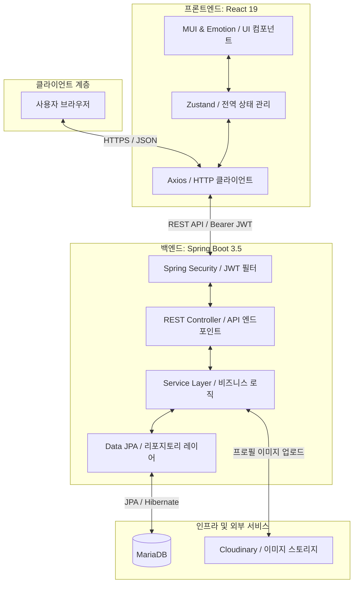

# 🤝 MATE: 스터디 & 프로젝트 매칭 플랫폼

## 💻 Developers

| <a href="https://github.com/hongjiho5148" target="_blank"></a> | <a href="https://github.com/Hyeonseok93" target="_blank"></a> | <a href="https://github.com/hjyouns" target="_blank"></a> | <a href="https://github.com/Jangdochi" target="_blank"></a> | <a href="https://github.com/nirey-l" target="_blank"></a> | <a href="https://github.com/pjcosmos" target="_blank"></a> |
|:-------------:|:------:|:------:|:------:|:------:|:------:|
| [홍지호(팀장)](https://github.com/hongjiho5148) | [김현석](https://github.com/Hyeonseok93) | [윤형진](https://github.com/hjyouns) | [장헌준](https://github.com/Jangdochi) | [이예린](https://github.com/nirey-l) | [박진아](https://github.com/pjcosmos) |

---

> [!NOTE]
> **SK쉴더스 루키즈 5기**에서 스프링부트 교육을 진행한 뒤 이어진 **두 번째 미니 프로젝트**입니다.

## 🚀 Overview

사이드 프로젝트나 스터디 팀원을 찾으려면 여러 커뮤니티에 모집글을 올리고, 지원자 정보와 합류 현황을 따로 관리해야 합니다. **MATE**는 개발자·디자이너·기획자가 모집부터 지원, 팀 확정과 협업까지 **한곳에서 이어 갈 수 있도록** 만든 매칭 플랫폼입니다.

React에서 프로젝트·스터디, 기술 스택, 키워드를 기준으로 모집글을 탐색하고, Spring Boot REST API가 **회원·모집글·지원서·프로젝트 멤버·팀 게시판**을 도메인별로 관리합니다. Spring Security와 JWT를 적용해 로그인 세션과 권한이 필요한 기능도 함께 처리합니다.

**모집글 작성 → 지원 → 모집자의 수락·거절 → 멤버 확정 → 팀 전용 게시판**으로 이어지는 흐름 위에 프로필, 댓글, 마이페이지 지원·모집 관리, 관리자 대시보드를 붙여 둔 팀 매칭 서비스입니다.

---

## 🛠 Built With

<p>
<picture>
  <source media="(prefers-color-scheme: dark)" srcset="assets/readme/badges/dark/javascript.png">
  <source media="(prefers-color-scheme: light)" srcset="assets/readme/badges/light/javascript.png">
  
</picture>
<picture>
  <source media="(prefers-color-scheme: dark)" srcset="assets/readme/badges/dark/react.png">
  <source media="(prefers-color-scheme: light)" srcset="assets/readme/badges/light/react.png">
  
</picture>
<picture>
  <source media="(prefers-color-scheme: dark)" srcset="assets/readme/badges/dark/reactrouter.png">
  <source media="(prefers-color-scheme: light)" srcset="assets/readme/badges/light/reactrouter.png">
  
</picture>
<picture>
  <source media="(prefers-color-scheme: dark)" srcset="assets/readme/badges/dark/mui.png">
  <source media="(prefers-color-scheme: light)" srcset="assets/readme/badges/light/mui.png">
  
</picture>
<picture>
  <source media="(prefers-color-scheme: dark)" srcset="assets/readme/badges/dark/zustand.png">
  <source media="(prefers-color-scheme: light)" srcset="assets/readme/badges/light/zustand.png">
  
</picture>
<picture>
  <source media="(prefers-color-scheme: dark)" srcset="assets/readme/badges/dark/axios.png">
  <source media="(prefers-color-scheme: light)" srcset="assets/readme/badges/light/axios.png">
  
</picture>
<picture>
  <source media="(prefers-color-scheme: dark)" srcset="assets/readme/badges/dark/vite.png">
  <source media="(prefers-color-scheme: light)" srcset="assets/readme/badges/light/vite.png">
  
</picture>
<picture>
  <source media="(prefers-color-scheme: dark)" srcset="assets/readme/badges/dark/msw.png">
  <source media="(prefers-color-scheme: light)" srcset="assets/readme/badges/light/msw.png">
  
</picture>
<picture>
  <source media="(prefers-color-scheme: dark)" srcset="assets/readme/badges/dark/java.png">
  <source media="(prefers-color-scheme: light)" srcset="assets/readme/badges/light/java.png">
  
</picture>
<picture>
  <source media="(prefers-color-scheme: dark)" srcset="assets/readme/badges/dark/springboot.png">
  <source media="(prefers-color-scheme: light)" srcset="assets/readme/badges/light/springboot.png">
  
</picture>
<picture>
  <source media="(prefers-color-scheme: dark)" srcset="assets/readme/badges/dark/springsecurity.png">
  <source media="(prefers-color-scheme: light)" srcset="assets/readme/badges/light/springsecurity.png">
  
</picture>
<picture>
  <source media="(prefers-color-scheme: dark)" srcset="assets/readme/badges/dark/jwt.png">
  <source media="(prefers-color-scheme: light)" srcset="assets/readme/badges/light/jwt.png">
  
</picture>
<picture>
  <source media="(prefers-color-scheme: dark)" srcset="assets/readme/badges/dark/hibernate.png">
  <source media="(prefers-color-scheme: light)" srcset="assets/readme/badges/light/hibernate.png">
  
</picture>
<picture>
  <source media="(prefers-color-scheme: dark)" srcset="assets/readme/badges/dark/mariadb.png">
  <source media="(prefers-color-scheme: light)" srcset="assets/readme/badges/light/mariadb.png">
  
</picture>
<picture>
  <source media="(prefers-color-scheme: dark)" srcset="assets/readme/badges/dark/thymeleaf.png">
  <source media="(prefers-color-scheme: light)" srcset="assets/readme/badges/light/thymeleaf.png">
  
</picture>
<picture>
  <source media="(prefers-color-scheme: dark)" srcset="assets/readme/badges/dark/cloudinary.png">
  <source media="(prefers-color-scheme: light)" srcset="assets/readme/badges/light/cloudinary.png">
  
</picture>
<picture>
  <source media="(prefers-color-scheme: dark)" srcset="assets/readme/badges/dark/maven.png">
  <source media="(prefers-color-scheme: light)" srcset="assets/readme/badges/light/maven.png">
  
</picture>
</p>

<details>
<summary><strong>기술 스택 상세 보기</strong></summary>

<br>

<div align="center">

<table align="center">
  <thead>
    <tr>
      <th align="left">구분</th>
      <th align="left">기술</th>
      <th align="left">역할</th>
    </tr>
  </thead>
  <tbody>
    <tr>
      <td align="left"><strong>Frontend Core</strong></td>
      <td align="left">JavaScript, React/React DOM 19.2.4, Vite 8.0.3</td>
      <td align="left">컴포넌트 기반 SPA 렌더링·개발 서버·프로덕션 번들</td>
    </tr>
    <tr>
      <td align="left"><strong>Routing &amp; UI</strong></td>
      <td align="left">React Router DOM 7.13.2, MUI/MUI Icons 7.3.9, Emotion 11.14</td>
      <td align="left">페이지 라우팅·보호 경로·공통 컴포넌트·테마와 CSS-in-JS</td>
    </tr>
    <tr>
      <td align="left"><strong>State &amp; HTTP</strong></td>
      <td align="left">Zustand 5.0.12, Axios 1.14.0</td>
      <td align="left">인증·게시글 전역 상태, API 모듈, JWT 인터셉터와 토큰 재발급</td>
    </tr>
    <tr>
      <td align="left"><strong>Frontend Dev &amp; Quality</strong></td>
      <td align="left">MSW 2.12.14, ESLint 9.39.4, React Hooks/Refresh Plugins</td>
      <td align="left">API 모킹 레이어(현재 런타임 비활성), 정적 분석·Hooks 규칙 검사</td>
    </tr>
    <tr>
      <td align="left"><strong>Backend Core</strong></td>
      <td align="left">Java 17, Spring Boot 3.5.13, Spring Web MVC, Bean Validation</td>
      <td align="left">REST API·서비스 계층·요청값 검증·전역 예외 처리</td>
    </tr>
    <tr>
      <td align="left"><strong>Persistence</strong></td>
      <td align="left">Spring Data JPA, Hibernate ORM 6.6.45, MariaDB JDBC 3.5.7</td>
      <td align="left">엔티티 매핑·리포지토리·도메인 관계와 운영 데이터 영속화</td>
    </tr>
    <tr>
      <td align="left"><strong>Database Support</strong></td>
      <td align="left">H2 2.3.232, Flyway 11.7.2</td>
      <td align="left">테스트용 인메모리 DB; Flyway는 의존성만 있으며 개발 환경에서 비활성·마이그레이션 파일 없음</td>
    </tr>
    <tr>
      <td align="left"><strong>Security</strong></td>
      <td align="left">Spring Security, JJWT 0.12.7, BCrypt</td>
      <td align="left">Access/Refresh Token 발급·검증, 인증 필터, 비밀번호 해싱, 권한 제어</td>
    </tr>
    <tr>
      <td align="left"><strong>Admin View</strong></td>
      <td align="left">Thymeleaf, Spring Security Form Login</td>
      <td align="left">관리자 로그인·대시보드·회원·프로젝트·감사 로그 서버 렌더링</td>
    </tr>
    <tr>
      <td align="left"><strong>Media</strong></td>
      <td align="left">Cloudinary Java SDK 1.36</td>
      <td align="left">프로필 이미지 업로드·CDN URL 관리, 로컬 정적 업로드 경로 지원</td>
    </tr>
    <tr>
      <td align="left"><strong>Backend Utilities</strong></td>
      <td align="left">Jackson, Lombok, Servlet Multipart</td>
      <td align="left">JSON 직렬화·보일러플레이트 절감·멀티파트 파일 처리</td>
    </tr>
    <tr>
      <td align="left"><strong>Build &amp; Development</strong></td>
      <td align="left">Maven Wrapper 3.9.14, Spring Boot DevTools</td>
      <td align="left">백엔드 빌드·의존성 관리·로컬 개발 편의 기능</td>
    </tr>
    <tr>
      <td align="left"><strong>Monitoring Dependencies</strong></td>
      <td align="left">Spring Boot Actuator, Spring Boot Admin Client 3.5.8</td>
      <td align="left">의존성만 선언된 상태이며 관리 엔드포인트·Admin 서버 연결 설정은 없음</td>
    </tr>
    <tr>
      <td align="left"><strong>Backend Test</strong></td>
      <td align="left">Spring Boot Test, JUnit 5, AssertJ, H2</td>
      <td align="left">애플리케이션 컨텍스트와 JPA 엔티티·DTO 매핑 검증</td>
    </tr>
  </tbody>
</table>

</div>

</details>

---

## 🖥️ Preview · [자세히 보기](https://bulldog93.tistory.com/46)

<div align="center">
  
  <p>메인 페이지</p>
</div>

<div align="center">

<table align="center">
  <thead>
    <tr>
      <th align="left">화면</th>
      <th align="left">설명</th>
    </tr>
  </thead>
  <tbody>
    <tr>
      <td align="left">🏠 홈</td>
      <td align="left">히어로, 스택·키워드 검색, 전체/스터디/프로젝트 필터, 모집글 카드 목록</td>
    </tr>
    <tr>
      <td align="left">📝 모집글 작성</td>
      <td align="left">카테고리·모집 인원·온/오프라인·기술 스택·마감일 설정</td>
    </tr>
    <tr>
      <td align="left">📄 모집글 상세</td>
      <td align="left">모집 조건·본문 확인, 지원하기 진입, 댓글 소통</td>
    </tr>
    <tr>
      <td align="left">✉️ 지원하기</td>
      <td align="left">지원 동기·포지션·연락처/포트폴리오 링크 제출</td>
    </tr>
    <tr>
      <td align="left">👤 마이페이지</td>
      <td align="left">닉네임·포지션·기술 스택·프로필 이미지 관리</td>
    </tr>
    <tr>
      <td align="left">📋 내 모집글 관리</td>
      <td align="left">지원자 목록 확인, 수락/거절 매칭</td>
    </tr>
    <tr>
      <td align="left">📨 내 신청 현황</td>
      <td align="left">내가 지원한 모집글의 대기·수락·거절 상태 확인</td>
    </tr>
    <tr>
      <td align="left">💬 팀 전용 게시판</td>
      <td align="left">매칭된 멤버만 접근하는 협업 게시글·댓글</td>
    </tr>
    <tr>
      <td align="left">🛠️ 관리자</td>
      <td align="left">회원·프로젝트 현황 대시보드, 삭제 데이터 복구</td>
    </tr>
  </tbody>
</table>

</div>

---

## 🌟 Key Implementation

1. **MSW로 프론트·백엔드 병렬 개발**  
   API 연동 전에 프론트가 막히지 않도록, 기획 단계 명세 기준으로 **MSW** 모킹을 붙였습니다.
   - 로컬에서 로그인·CRUD 등 핵심 플로우를 백엔드 완성 전에 구현·검증할 수 있었습니다.
   - 실제 API 연결 시에도 UI 쪽 흐름을 크게 바꾸지 않고 전환할 수 있게 맞춰 두었습니다.

2. **Axios Interceptor 기반 Silent JWT 갱신**  
   Access Token 만료마다 강제 로그아웃되지 않도록, `401` 응답을 Interceptor에서 가로챕니다.
   - Refresh Token으로 Access Token을 갱신한 뒤, 실패했던 원 요청을 **자동 재시도**합니다.
   - 사용자는 세션 연장을 의식하지 않고 연속으로 API를 쓸 수 있습니다.

3. **Mapper로 Entity ↔ DTO 관심사 분리**  
   서비스 계층에 변환 코드가 섞이지 않도록 **Mapper 클래스**로 매핑을 모았습니다.
   - Lombok `@Builder`로 명시적 변환을 유지하고, Entity와 API 응답 스펙 변경 지점을 분리했습니다.
   - 응답 포맷 수정 시 서비스 로직보다 매퍼 쪽을 먼저 손볼 수 있게 했습니다.

4. **Cloudinary 프로필 이미지 업로드**  
   서버 로컬 디스크에 이미지를 쌓지 않고 **Cloudinary**로 업로드·CDN 배포합니다.
   - 앱 서버 스토리지 부하를 줄이고, 프로필 이미지 로딩을 CDN 쪽으로 넘겼습니다.

5. **Zustand 정규화 브릿지 (API 스펙 완충)**  
   백엔드 필드명·페이징 포맷이 엔드포인트마다 달랐던 구간을 스토어에서 한 번 맞춰 둡니다.
   - `authStore` / `postStore`에서 `id`↔`userId`, `profileImg`↔`profileImageUrl` 등을 **내부 표준**으로 정규화합니다.
   - 화면 컴포넌트는 스토어 표준만 보고, API 스펙 흔들림에 덜 결합되게 했습니다.

6. **MUI Custom Theme 디자인 토큰**  
   인라인 스타일 난립을 막기 위해 `createTheme`로 브랜드 토큰을 고정했습니다.
   - Primary `#6C63FF`, Soft `#EDE9FF`, Pretendard, `borderRadius: 16` 등을 전역 토큰으로 관리합니다.
   - Button / Card / Chip `styleOverrides`로 공통 컴포넌트 톤을 맞춰 UI 파편화를 줄였습니다.

---

## ✨ 핵심 기능 (Key Features)

### 👥 회원 및 인증 (Auth & User Profile)

- **JWT 기반 인증**: Access Token 및 Refresh Token 구조를 활용한 안전하고 지속적인 로그인 세션 관리.
- **포지션/기술 스택 관리**: 본인의 직군(프론트엔드, 백엔드, 디자이너, 기획 등)과 다룰 수 있는 기술 스택을 프로필에 설정.

### 📋 프로젝트 및 스터디 모집 (Recruitment Board)

- **다양한 필터링**: 카테고리(프로젝트/스터디), 기술 스택, 키워드 별 스마트 필터링 및 검색.
- **상세 조건 설정**: 모집 정원, 진행 기간, 온/오프라인 여부, 요구 기술 스택 정의.
- **댓글 소통**: 상세 모집 페이지 내에서 자유로운 사전 질의응답 및 피드백.

### ✉️ 지원 & 매칭 시스템 (Application & Matching)

- **원클릭 지원**: 지원 동기를 작성하여 관심 있는 프로젝트에 바로 지원.
- **지원자 수락/거절**: 작성자(방장)는 마이페이지를 통해 신청 대기자 명단을 확인하고 수락 혹은 거절 가능.
- **프로젝트 멤버 목록**: 매칭이 성사된 팀원들의 포지션과 프로필을 목록으로 확인.

### 💬 협업 공간 (Project Internal Board)

- **팀 전용 게시판**: 최종 매칭된 멤버들만 접근하여 글을 쓰고 댓글을 달 수 있는 소통 창구 제공.

### 🛠️ 관리자 기능 (Admin Console)

- **대시보드**: 전체 가입자 수, 진행 중인 프로젝트 수 등 핵심 지표 시각화.
- **데이터 복구**: 실수로 삭제되거나 보관 처리된 회원 정보 및 리소스를 복구하는 백 오피스 툴.

---

## 📂 프로젝트 구조 (Repository Directory Structure)

MATE는 프론트엔드(React)와 백엔드(Spring Boot) 레포지토리가 통합되어 관리되는 모노레포 구조를 가집니다.

```text
SK-Rookies5-MINI2_MATE/
├── MATE-frontend/             # React Client Web App
│   ├── src/
│   │   ├── api/               # Axios Instance & Interceptors
│   │   ├── component/         # Reusable UI Components (common, layout)
│   │   ├── constants/         # Static Data Definitions
│   │   ├── mocks/             # MSW Mock Handlers for Local Dev
│   │   ├── pages/             # Route Pages (Main, PostDetail, Auth, MyPage)
│   │   ├── store/             # Zustand Stores (authStore, etc.)
│   │   └── styles/            # MUI Custom Theme Definitions
│   └── package.json
│
├── MATE-backend/              # Spring Boot REST API Server
│   ├── src/main/java/.../
│   │   ├── common/            # Success/Error Base Responses
│   │   ├── config/            # Security, Web, Cloudinary Configs
│   │   ├── controller/        # REST APIs (Auth, Project, Apply, Admin)
│   │   ├── entity/            # JPA Entities & Enums
│   │   ├── repository/        # Spring Data JPA Repository Interfaces
│   │   ├── security/          # JWT Helpers & Filters
│   │   └── service/           # Business Logic Interfaces & Impls
│   └── pom.xml

```

---

## 📊 시스템 아키텍처 (System Architecture)

MATE 서비스의 서비스 구조 및 모듈 간 관계는 다음과 같습니다.



---

## ⚙️ 설치 및 실행 방법 (Getting Started)

### Prerequisites

- JDK 17 이상
- Node.js 18.x 이상 및 npm
- MariaDB 10.x 이상

### 1. Database 설정

로컬 MariaDB에 접속하여 프로젝트용 스키마를 생성합니다.

```sql
CREATE DATABASE mate_db;
```

### 2. Backend 실행

1. `MATE-backend` 디렉토리로 이동합니다.
   ```bash
   cd MATE-backend
   ```
2. 예시 파일을 복사해 `.env`를 만들고 로컬 환경에 맞게 값을 설정합니다.
   ```bash
   # Windows
   copy .env.example .env

   # macOS / Linux
   cp .env.example .env
   ```
   ```env
   DB_URL=jdbc:mariadb://localhost:3306/mate_db
   DB_USER=사용자이름
   DB_PASSWORD=비밀번호
   JWT_SECRET=최소_32글자_이상의_임의의_시크릿_키
   CLOUDINARY_CLOUD_NAME=your_cloud_name
   CLOUDINARY_API_KEY=your_api_key
   CLOUDINARY_API_SECRET=your_api_secret
   ```
   `.env`는 Git에서 제외되며 실제 인증정보를 커밋하지 않습니다.
3. 서버를 구동합니다.

   ```bash
   # Windows
   mvnw.cmd spring-boot:run

   # Linux/macOS
   ./mvnw spring-boot:run
   ```

   - 백엔드 서버는 `http://localhost:8080`에서 구동됩니다.

### 3. Frontend 실행

1. `MATE-frontend` 디렉토리로 이동합니다.
   ```bash
   cd MATE-frontend
   ```
2. `.env.development` 환경 변수를 설정합니다.
   ```env
   VITE_API_BASE_URL=http://localhost:8080/api
   ```
3. 패키지를 설치하고 개발 서버를 시작합니다.
   ```bash
   npm install
   npm run dev
   ```

   - 프론트엔드 웹 앱은 `http://localhost:5173`에서 확인할 수 있습니다.

---

## 🖥️ 주요 화면 가이드 (Features Walkthrough)

### 1. 메인 페이지 (Main Discovery)
- **설명**: 최신 프로젝트 및 스터디 모집글을 한눈에 탐색할 수 있는 허브 화면입니다. 카테고리(프로젝트/스터디), 기술 스택 필터, 키워드 검색을 조합하여 원하는 모집공고를 신속하게 필터링할 수 있습니다.
- *(추후 화면 캡처 및 GIF 추가 영역)*

### 2. 모집공고 상세 및 지원 (Project Detail & Apply)
- **설명**: 프로젝트의 진행 기간, 온/오프라인 여부, 모집 직군(프론트엔드/백엔드/기획 등), 요구 스택 등 상세 구인 조건을 보여줍니다. 
- **지원 프로세스**: 하단의 '지원하기' 버튼을 눌러 지원 동기를 입력하면 즉시 지원서가 제출됩니다.
- *(추후 화면 캡처 및 GIF 추가 영역)*

### 3. 마이페이지 - 모집 관리 (Recruitment Dashboard)
- **설명**: 자신이 생성한 모집글에 지원한 유저들의 프로필과 포지션, 지원 동기를 확인하는 방장 전용 대시보드입니다.
- **매칭 매커니즘**: 각 지원자 카드 우측의 '수락' 혹은 '거절' 버튼을 눌러 직관적으로 팀원을 빌딩할 수 있습니다.
- *(추후 화면 캡처 및 GIF 추가 영역)*

### 4. 마이페이지 - 지원 현황 (My Applications)
- **설명**: 내가 참여를 신청한 프로젝트/스터디 목록과 각 매칭 상태(승인 대기, 수락됨, 거절됨)를 실시간으로 확인하는 개인 대시보드입니다.
- *(추후 화면 캡처 및 GIF 추가 영역)*

### 5. 팀 전용 협업 게시판 (Private Board)
- **설명**: 모집이 완료되어 합격된 팀원들만 접근할 수 있는 내부 소통용 Private 공간입니다. 외부 유저의 접근을 막아 팀 전용 공지나 협업 링크 공유 등의 원활한 소통을 보조합니다.
- *(추후 화면 캡처 및 GIF 추가 영역)*

---

## 🔧 Backend details (`MATE-backend`)

### 프로젝트 구조

```text
src/main/java/com/rookies5/Backend_MATE/
├── common/              # 공통 응답 처리 (SuccessResponse)
├── config/              # Security, Web, Cloudinary 등 설정 클래스
├── controller/          # REST API 컨트롤러
├── dto/                 # Request/Response Data Transfer Object
├── entity/              # JPA 엔티티 및 Enum (BaseEntity 상속)
├── exception/           # 전역 예외 처리 및 커스텀 에러 코드
├── mapper/              # Entity <-> DTO 변환 로직 (Mapper)
├── repository/          # Spring Data JPA 리포지토리
├── security/            # JWT 및 시큐리티 관련 유틸리티 (JwtTokenProvider 등)
└── service/             # 비즈니스 로직 인터페이스 및 구현체 (impl)
```

### 핵심 도메인 및 ERD 개요

- **User (회원)**: 닉네임, 기술 스택, 포지션 정보를 보유하며 여러 프로젝트를 소유하거나 참여할 수 있습니다.
- **Project (모집글)**: 카테고리, 모집 인원, 기술 스택을 정의하며 특정 `User`가 생성(Owner)합니다.
- **Application (지원서)**: `User`가 `Project`에 지원할 때 생성되며, 방장에 의해 승인/거절 상태가 결정됩니다. (1:N 관계)
- **ProjectMember (참여 멤버)**: 프로젝트에 최종 합류된 인원들을 관리합니다. (User-Project N:M 해소 엔티티)
- **BoardPost & Comment**: 각 프로젝트 내에서 소통을 위한 게시글과 댓글 기능을 제공합니다.

### 주요 API 기능 요약

#### 인증 및 회원 (Auth & User)
- `POST /api/auth/signup`: 회원가입
- `POST /api/auth/login`: 로그인 및 JWT 발급
- `GET /api/users/me`: 내 정보 조회 및 수정 (`PATCH /me`)
- `GET /api/users/me/posts/owned`: 내가 생성한 프로젝트 목록 조회

#### 프로젝트 모집 (Project)
- `POST /api/projects`: 모집글 생성
- `GET /api/projects`: 전체 목록 조회 (필터링: 카테고리, 키워드)
- `PATCH /api/projects/{id}/close`: 모집 수동 마감
- `PATCH /api/projects/{id}/reopen`: 프로젝트 재모집 시작

#### 지원 및 멤버 (Application & Member)
- `POST /api/applications/{projectId}`: 프로젝트 지원하기
- `PATCH /api/applications/{id}/status`: 지원서 상태 변경 (승인/거절)
- `GET /api/posts/{projectId}/members`: 프로젝트 참여 멤버 조회

#### 게시판 및 댓글 (Board & Comment)
- `GET /api/posts/{projectId}/board`: 프로젝트 내 게시글 목록
- `POST /api/posts/{projectId}/board/{postId}/comments`: 댓글 작성

#### 관리자 (Admin)
- `GET /admin/dashboard`: 전체 서비스 현황 대시보드
- `POST /admin/users/restore/{id}`: 삭제된 회원 및 데이터 복구

---

## 🎨 Frontend details (`MATE-frontend`)

### 디렉토리 구조

```bash
src/
├── api/             # API 호출 함수 및 Axios 인스턴스 (Interceptor 포함)
├── assets/          # 이미지, SVG 등 정적 리소스
├── component/       # 재사용 가능한 UI 컴포넌트
│   ├── common/      # Button, PostCard, Avatar 등 공통 컴포넌트
│   └── layout/      # Header, Footer, MainLayout 등 레이아웃
├── constants/       # 기술 스택 목록 등 고정값 정의
├── mocks/           # MSW 핸들러 및 모의 데이터 (Mock Data)
├── pages/           # 주요 서비스 화면 (View)
├── store/           # Zustand 기반 상태 관리 스토어
├── styles/          # MUI Theme 및 전역 CSS 설정
└── utils/           # 날짜 포맷, 상태 변환 등 유틸리티 함수
```

### API 연동
- `src/api/axiosInstance.js`에서 공통 설정을 관리합니다.
- **인증 처리**: Request Interceptor를 통해 `Authorization` 헤더에 Bearer 토큰을 자동으로 주입합니다.
- **토큰 갱신**: Response Interceptor에서 401 에러 감지 시 Refresh Token을 사용해 자동으로 Access Token을 재발급받습니다.

### 빌드
```bash
cd MATE-frontend
npm install
npm run dev      # http://localhost:5173
npm run build    # dist/ 생성
```

